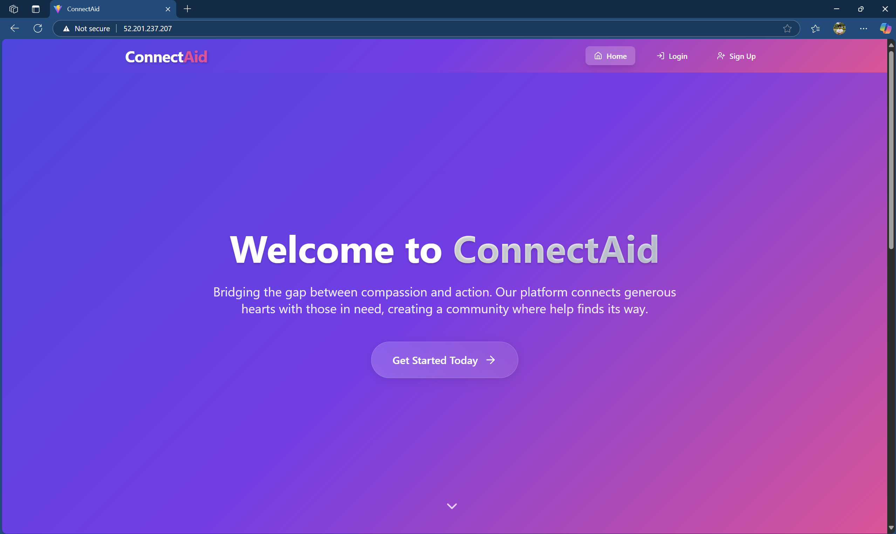
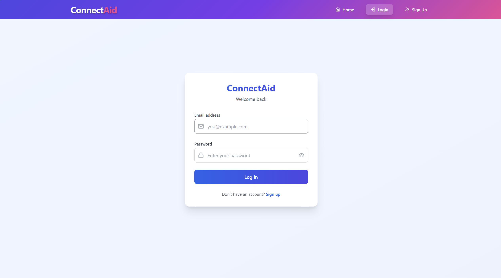
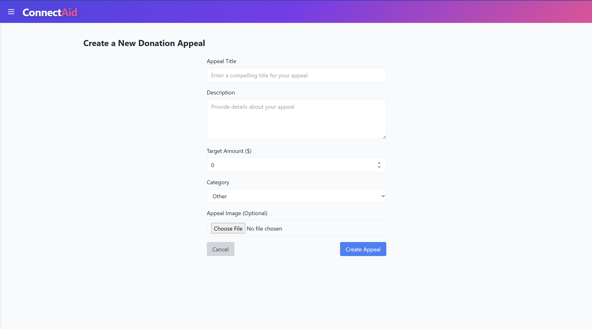
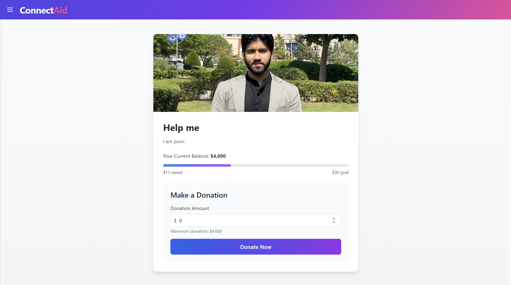

# ConnectAid

ConnectAid is a full-stack MERN (MongoDB, Express, React, Node.js) platform designed to bridge the gap between compassion and action. It connects generous donors with those in need, facilitating transparent and easy-to-manage appeals for medical, educational, emergency, and community causes.



## Table of Contents

- [Features](#features)
- [Tech Stack](#tech-stack)
- [Installation](#installation)
- [Usage](#usage)
- [API Reference](#api-reference)
- [Configuration](#configuration)
- [Architecture](#architecture)
- [Contributing](#contributing)
- [License](#license)

## Features

- **User Authentication**: Secure Sign Up and Login functionality using JWT (JSON Web Tokens).
- **Appeal Management**: Users can create, edit, delete, and view their own appeals.
- **Categorized Appeals**: Organize appeals by categories such as Medical, Education, Emergency, and Community.
- **Donation System**: Seamless donation process to support active appeals.
- **Real-time Updates**: Track raised amounts against target goals.
- **Responsive Design**: Fully responsive UI built with React, Tailwind CSS, and Framer Motion.
- **Image Uploads**: Support for uploading images for appeals.
- **Containerized**: Fully dockerized application with Nginx reverse proxy.
- **CI/CD**: Integrated Jenkins pipeline and Selenium E2E testing.

## Tech Stack

- **Frontend**: React, TypeScript, Tailwind CSS, Framer Motion, Redux Toolkit, Vite.
- **Backend**: Node.js, Express.js, MongoDB (Mongoose).
- **DevOps**: Docker, Docker Compose, Nginx, Jenkins.
- **Testing**: Selenium, Mocha.

## Installation

### Prerequisites

- Node.js (v18+)
- Docker & Docker Compose (Recommended)
- MongoDB (if running locally without Docker)

### Option 1: Using Docker (Recommended)

1. **Clone the repository**
   ```bash
   git clone <repository-url>
   cd Connect_Aid
   ```

2. **Create Environment File**
   Create a `.env` file in `backEnd/` (see [Configuration](#configuration)).

3. **Run with Docker Compose**
   ```bash
   docker-compose up --build
   ```

   The application will be available at:
   - Frontend: `http://localhost:80` (via Nginx) or `http://localhost:5173` (direct)
   - Backend: `http://localhost:5000`

### Option 2: Manual Setup

1. **Clone the repository**
   ```bash
   git clone <repository-url>
   cd Connect_Aid
   ```

2. **Backend Setup**
   ```bash
   cd backEnd
   npm install
   # Create .env file (see Configuration section)
   npm start
   ```

3. **Frontend Setup**
   ```bash
   cd frontEnd
   npm install
   npm run dev
   ```

## Usage

### Authentication
Users can sign up for a new account or log in to an existing one.



### Creating an Appeal
Once logged in, navigate to the "Raise" section to create a new appeal. Fill in the title, description, target amount, and category.



### Making a Donation
Browse active appeals and donate to causes that matter to you.



## API Reference

### Appeals

- **Get all active appeals**
  ```http
  GET /api/appeals
  ```

- **Create an appeal**
  ```http
  POST /api/appeals
  ```
  Body: `title`, `description`, `targetAmount`, `category`, `image` (file)

- **Get single appeal**
  ```http
  GET /api/appeals/:id
  ```

### Donations

- **Make a donation**
  ```http
  POST /api/donations/:appealId
  ```
  Body:
  ```json
  {
    "amount": 100
  }
  ```

### Authentication

- **Register**
  ```http
  POST /api/auth/register
  ```

- **Login**
  ```http
  POST /api/auth/login
  ```

## Configuration

Create a `.env` file in the `backEnd/` directory with the following variables:

```env
NODE_ENV=production
PORT=5000
MONGO_URI=your_mongodb_connection_string
JWT_SECRET=your_jwt_secret_key
JWT_EXPIRE=24h
CURRENT_HOST=localhost
FRONTEND_PORT=80
ADDITIONAL_ORIGINS=http://localhost:5173
```

## Architecture

The project follows a standard MERN architecture with a separate frontend and backend, orchestrated by Docker.

```
Connect_Aid/
├── backEnd/                 # Express.js Backend
│   ├── models/              # Mongoose Models (User, Appeal)
│   ├── routes/              # API Routes
│   ├── middleware/          # Auth Middleware
│   └── uploads/             # Image Uploads
├── frontEnd/                # React Frontend
│   ├── src/
│   │   ├── components/      # Reusable Components
│   │   ├── pages/           # Application Pages
│   │   ├── services/        # API Services
│   │   └── api/             # Axios Configuration
├── tests/                   # Selenium E2E Tests
├── docs/                    # Documentation & Images
└── docker-compose.yaml      # Container Orchestration
```

## Contributing

Contributions are welcome! Please follow these steps:

1. Fork the repository.
2. Create a new branch (`git checkout -b feature/AmazingFeature`).
3. Commit your changes (`git commit -m 'Add some AmazingFeature'`).
4. Push to the branch (`git push origin feature/AmazingFeature`).
5. Open a Pull Request.

## License

Distributed under the MIT License. See `LICENSE` for more information.
